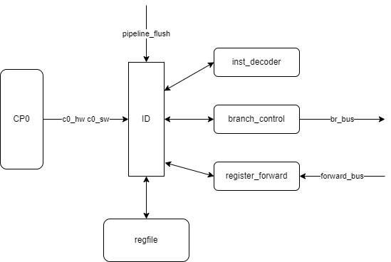
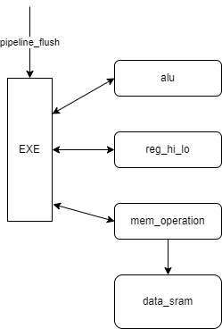
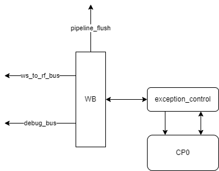
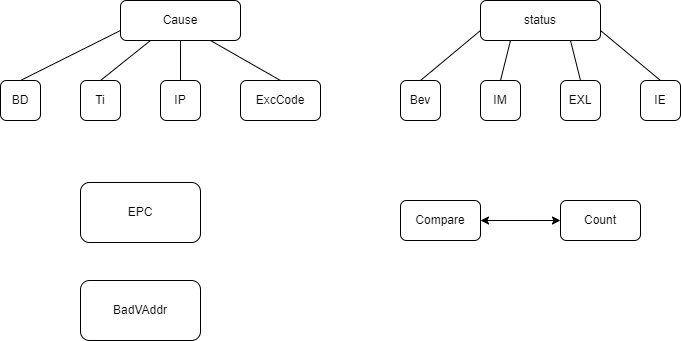

# Pipeline


## IF stage


### to ID

```verilog
typedef struct packed {
	// pipeline
	logic 		 valid;
	// IF to ID
    uint32_t 	 inst;
    virt_t 		 pc;
    // exception
	exception_t  exception;
} fs_to_ds_bus_t;
```

### pre-IF

从 inst_sram 预取下一条指令 (next_pc)

### br_bus

`stall` 表示发生 load-branch 冲突，需要阻塞一个周期；`bd` 表示 ID 阶段为分支或跳转指令，即 IF 阶段为分支延迟槽指令；`taken` 表示跳转是否发生；`target` 表示跳转地址

```verilog
typedef struct packed {
    logic  stall;
    logic  bd;
    logic  taken;
    virt_t target;
} br_bus_t;
```

### CP0

`epc` 表示在异常处理完成后需要跳转的地址

### 异常

当 `fs_pc[1:0] != 0` 发生地址错误异常-取指，错误地址 `fs_pc` 放入 `exception.badvaddr`

```verilog
assign exception.bd = br_bus.bd;
assign exception.ex = fs_valid && (fs_pc[1:0] != 2'h0);
assign exception.exccode = `EXCCODE_ADEL;
assign exception.badvaddr = fs_pc;
```

## ID stage



### to EXE

```verilog
typedef struct packed {
	// pipeline
	logic 		 valid;
	// ID to EXE
	logic [11:0] alu_op;
	logic 		 alu_ov;
	logic [ 6:0] load_op;
	logic [ 4:0] store_op;
	logic [ 7:0] hi_lo_op;
	logic [ 2:0] c0_op;
	logic [ 7:0] c0_addr;
	logic 		 src1_is_sa;
	logic   	 src1_is_pc;
	logic  		 src2_is_simm;
	logic 		 src2_is_zimm;
	logic 		 src2_is_8;
	logic 		 res_from_mem;
	logic 		 res_to_mem;
	logic 		 rf_we;
	reg_addr_t 	 dest;
	uint16_t 	 imm;
	uint32_t 	 rs_value;
	uint32_t 	 rt_value;
	virt_t 	 	 pc;
    // exception
	exception_t  exception;
} ds_to_es_bus_t;
```

### inst_decoder

指令译码

```verilog
typedef struct packed {
	logic 		 invalid;

	reg_addr_t 	 rs;
	reg_addr_t   rt;
	reg_addr_t 	 rd;

	logic [11:0] alu_op;
	logic    	 alu_ov;
	logic [11:0] br_op;
	logic [ 7:0] hi_lo_op;
	logic [ 6:0] load_op;
	logic [ 4:0] store_op;
	logic [ 2:0] c0_op;
	logic [ 7:0] c0_addr;

	logic        src1_is_sa;
	logic        src1_is_pc;
	logic        src2_is_simm;
	logic        src2_is_zimm;
	logic        src2_is_8;
	logic        res_from_mem;
	logic        res_to_mem;
	logic 		 rf_we;
	reg_addr_t	 dest;
	uint16_t  	 imm;
	logic [25:0] jidx;

	logic  		 op_syscall;
	logic 		 op_break;
} decoded_inst_t;
```

### branch_control

分支控制，输出 br_bus，决定 IF 是否跳转，以及跳转地址

```verilog
module branch_control (
    input  ds_valid,
    input logic [11:0] br_op,
    input uint32_t rs_value,
    input uint32_t rt_value,
    input virt_t fs_pc,
    input uint16_t imm,
    input logic [25:0] jidx,
    input  ds_stall,
    output br_stall,
    output br_taken,
    output virt_t br_target
);
```

### register_forward

根据 EXE、MEM、WB 前递的结果以及通用寄存器组 regfile 的结果计算出正确的 rs_value 和 rt_value

当 EXE 为 load 类指令或 EXE、MEM、WB 为 mfc0 指令时，阻塞信号 ds_stall 有效

```verilog
module register_forward(
    input ds_valid,
    input decoded_inst_t inst_d,
    // regfile
    input uint32_t   rf_rdata1,
    input uint32_t   rf_rdata2,
    // es forward
    input            es_mfc0,
    input            es_load,
    input reg_addr_t es_dest,
    input uint32_t   es_result,
    // ms forward
    input            ms_mfc0,
    input [ 3:0]     ms_rf_we,
    input reg_addr_t ms_dest,
    input uint32_t   ms_result,
    // ws forward
    input            ws_mfc0,
    input [ 3:0]     ws_rf_we,
    input reg_addr_t ws_dest,
    input uint32_t   ws_result,
    // result
    output uint32_t  rs_value,
    output uint32_t  rt_value,
    // stall
    output           ds_stall
);
```

### 异常

1. 当来自 CP0 的 `c0_hw` 和 `c0_sw` 有效时，触发硬件中断

2. 来自 IF 的指令有异常时，继续传递

3. inst_decoder 模块发现指令无效时触发保留指令异常

4. inst_decoder 模块发现 syscall 和 break 指令触发系统调用异常和陷阱意外

## EXE stage



### to MEM

```verilog
typedef struct packed {
	// pipeline
	logic 		 valid;
	// EXE to MEM
	logic [ 6:0] load_op;
    logic [ 2:0] c0_op;
	logic [ 7:0] c0_addr;
	logic 		 res_from_mem;
	logic 		 rf_we;
	reg_addr_t 	 dest;
	uint32_t 	 result;
    virt_t 		 pc;
    // exception
	exception_t  exception;
} es_to_ms_bus_t;
```

### alu

算术运算模块

```verilog
wire op_add;   //> 加法操作
wire op_sub;   //> 减法操作
wire op_slt;   //> 有符号比较，小于置位
wire op_sltu;  //> 无符号比较，小于置位
wire op_and;   //> 按位与
wire op_nor;   //> 按位或非
wire op_or;    //> 按位或
wire op_xor;   //> 按位异或
wire op_sll;   //> 逻辑左移
wire op_srl;   //> 逻辑右移
wire op_sra;   //> 算术右移
wire op_lui;   //> 立即数置于高半部分
```

### reg_hi_lo

乘除运算指令和 HI/LO 寄存器交互

除法采用多周期实现，EXE 级阻塞直到 `hi_lo_ready` 有效

当 EXE、MEM、WB 出现异常或为 eret 指令，禁止写操作 (wr_disable)

```verilog
module reg_hi_lo (
    input clk,
    input reset,

    input logic [ 7:0] hi_lo_op,
    input uint32_t src1,
    input uint32_t src2,

    output hi_lo_ready,
    output uint32_t hi_lo_result,

    input  wr_disable
);
```

### mem_operation

发出内存读写请求 (store & load)

```verilog
module mem_operation (
    input logic [6:0] load_op,
    input logic [4:0] store_op,
    input             wr_disable,
    input virt_t      mem_addr,
    input uint32_t    mem_wdata,
    // exception
    output              mem_ex,
    output logic [4:0]  mem_exccode,
    // data sram interface
    output          data_sram_en,
    output [ 3:0]   data_sram_wen,
    output virt_t   data_sram_addr,
    output uint32_t data_sram_wdata
);
```

### 异常

1. 来自 ID 的指令有异常时，继续传递

2. alu 模块计算结果溢出时，触发整型溢出异常

3. mem_operation 模块内存读写地址错误时，触发地址错误异常-数据访问

## MEM stage


### to WB

```verilog
typedef struct packed {
	// pipeline
	logic 		 valid;
	// MEM to WB
    logic [ 2:0] c0_op;
	logic [ 7:0] c0_addr;
	logic [ 3:0] rf_we;
	reg_addr_t 	 dest;
	uint32_t 	 result;
    virt_t 		 pc;
    // ex
	exception_t  exception;
} ms_to_ws_bus_t;
```

### mem_load

根据 load 指令的不同，计算出正确的访存结果 `mem_result` 和通用寄存器写信号 `rf_we`

```verilog
module mem_load (
    input  logic [6:0]  load_op,
    input               rf_wr,
    input  virt_t       mem_addr,
    input  uint32_t     data_sram_rdata,

    output logic [3:0]  rf_we,
    output uint32_t     mem_result
);
```

### 异常

仅传递，不产生新的异常

## WB_stage



### exception_control

产生异常和清除异常以及与 CP0 交互

```verilog
module  exception_control (
    input  ws_valid,

    input  logic [2:0] c0_op,
    input  logic [7:0] ws_c0_addr,
    input  uint32_t    ws_result,
    // cp0 interface
    output             c0_we,
    output logic [7:0] c0_addr,
    output uint32_t    c0_wdata,
    input  uint32_t    c0_rdata,
    // exception
    output eret_flush, //< 异常清除
    output ex_en,      //< 产生异常
    // to cp0
    // 异常传递到 cp0
    input  virt_t       ws_pc,
    input  exception_t  ws_exception,
    output              c0_eret_flush,
    output exception_t  c0_exception,
    output virt_t       c0_pc
);
```

### ws_to_rf_bus

数据写回通用寄存器组 regfile

```verilog
typedef struct packed {
	logic [ 3:0] we;
	reg_addr_t   waddr;
	uint32_t     wdata;
} ws_to_rf_bus_t;
```

### ws_to_c0_bus

异常传递到 CP0

```verilog
typedef struct packed {
    logic        bd;
    logic        ex;
    logic [ 4:0] exccode;
    virt_t 		 badvaddr;
} exception_t;

typedef struct packed {
	logic 		 eret_flush;
	exception_t  exception;
	virt_t 		 pc;
} ws_to_c0_bus_t;
```

### pipeline_flush

产生和清除异常时清空流水线

```verilog
typedef struct packed {
	logic ex;
	logic eret;
} pipeline_flush_t;
```

### 异常

WB 级产生异常并读写 CP0 数据。因此 op_mfc0 不能前递数据，冲突时必须阻塞直到 op_mfc0 到 WB 级。

## CP0



### BadVAdddr

只读，记录最后一次导致发生地址错误异常的虚地址

### Count & Compare

Count 以流水线时钟一半频率自增，当 `Count == Compare` 时触发计时器中断，`Cause.TI` 置 1。写 Compare 寄存器时，自动将`Cause.TI`置 0，清除中断。

### Status

`Bev` 恒为 1

`IM` 中断屏蔽位
- 1：使能
- 0：屏蔽

`EXL` 异常状态
- 1：异常级，处理器处于核心态，软硬件中断屏蔽，EPC，Cause.BD 不更新
- 0：正常级

`IE` 中断使能
- 0：屏蔽中断
- 1：使能

### Cause

`BD` 异常指令是否处于分支延迟槽（分支指令的下一个指令）

`TI` 计时器中断

`IP` 7~2 分别对应硬件中断 5~0；1~0 分别对应软件中断 1~0

`ExcCode` 异常编码

### EPC

异常处理完成后继续执行的指令的 PC
