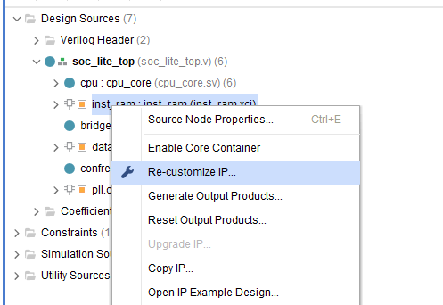
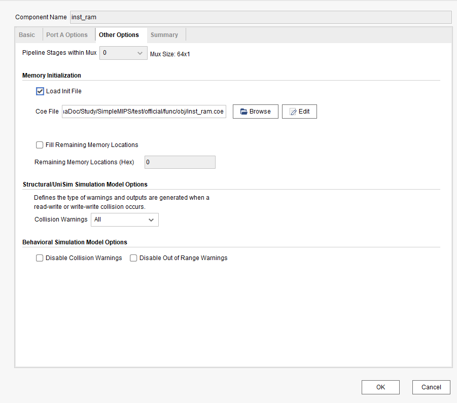

# Vivado 使用

## 重载 IP 核

右键 inst_sram 或 data_sram，选择 re-customize IP

在 other options 里修改 coe file

coe file 文件在 SimpleMIPS/test/official/func/obj，都是已经编译完成的

如果找不到源文件和IP，建议直接在项目里先把所有文件remove，再重新添加回去
